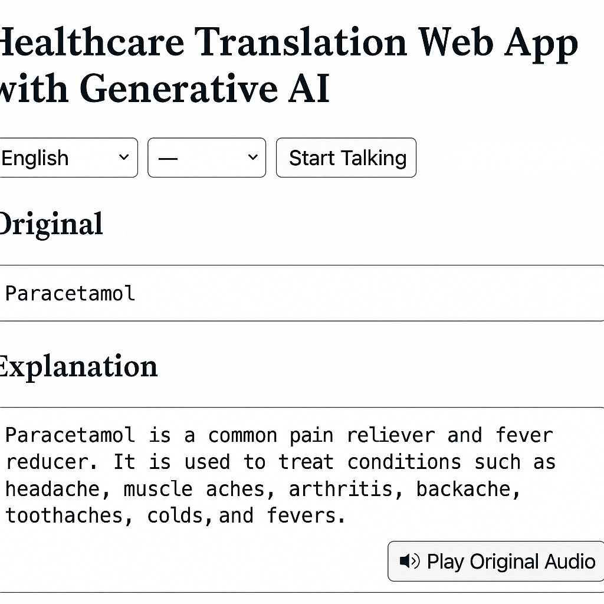

# 🩺 Healthcare Translation Web App with Generative AI

## 📌 Why This App? (The Need)

Language barriers in healthcare settings can result in **misdiagnosis**, **medication errors**, and **inequitable care**. Patients who don’t speak the same language as their provider often struggle to describe symptoms or understand medical instructions — especially when it involves complex **medical terminology**.

---

## 🎯 Purpose of the Application

This project aims to **bridge the communication gap** between patients and healthcare providers by:

- 🔊 Listening to a patient’s voice in real time  
- 🧠 Explaining complex **medical terms** clearly using Generative AI  
- 🌍 Translating the explanation into the **provider or patient’s preferred language**  
- 🎧 Playing back the explanation via audio (Text-to-Speech)

> This app is designed to be **fast, accurate, and mobile-friendly**, making it ideal for **clinics, field hospitals, or remote care settings**.

---

## 🚀 Key Features

| Feature                        | Description                                      |
|-------------------------------|--------------------------------------------------|
| 🎤 Voice-to-Text               | Speak naturally and transcribe instantly         |
| 🧠 Medical Explanation via GPT | Clear, patient-friendly AI explanations          |
| 🌐 Real-Time Translation       | Into 7+ languages including Hindi, French, Arabic|
| 🔊 Speech Playback             | Translated output is spoken aloud                |
| 🎧 Replay Original Voice       | Hear your recorded voice again                   |
| 📱 Mobile Friendly             | Responsive layout for any device                 |

---

## 🧠 How It Works

1. User speaks a medical term like **“Paracetamol”**
2. The app transcribes it and sends it to OpenAI's GPT
3. GPT returns an **explanation** (if it’s a medical term)
4. The explanation is then **translated** to the selected output language
5. Translated text is played back using speech synthesis

---

## 💡 How to Use

1. Select your **input** and **output** language  
2. Click **“🎤 Start Talking”**  
3. Speak a word or sentence like `I take Glycomet in the morning`  
4. View:
   - 📝 **Original Transcript**
   - 📖 **Explanation**
   - 🌐 **Translated Explanation**
5. Use:
   - 🔊 **Speak Translated**
   - 🔊 **Play Original Audio**

---

## ✅ Expected Results

- ✅ Clear explanation of medical terms using AI
- ✅ Accurate multilingual translation
- ✅ Voice input and voice playback
- ✅ Great user experience for both patients and providers

---

## 🖼️ Screenshots

### 🎤 1. Voice Input and Language Selection  

### 📖 2. Medical Term Explanation  

### 🌍 3. Translated Explanation with Playback  

---

## 📂 Screenshot Setup Tips

1. Create a folder called `screenshots/` in your repo
2. Save images there as:
   - `voice-input.png`
   - `explanation.png`
   - `translated.png`
3. GitHub will render them inline in your README

---

## 🧑‍⚕️ Example Use Case

> “A patient who speaks Hindi visits a clinic where the doctor only speaks English.  
> The patient says ‘Glycomet’.  
> The app explains it’s a diabetes medication, then translates the explanation to English for the doctor and speaks it aloud.”

---

## 📎 Live App Link

👉 [Try it here](https://healthcare-translator-api.onrender.com)

---

